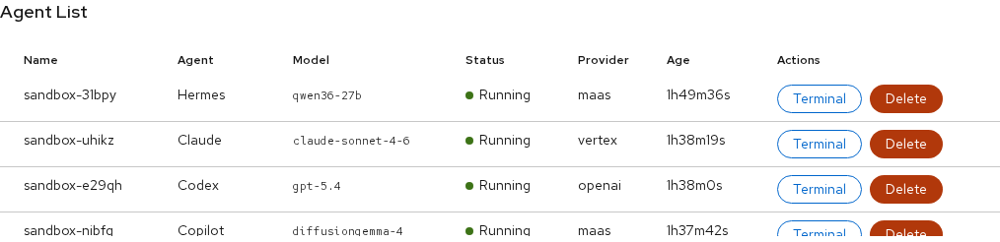

# Agent List & Sandboxes

Topics: Deploy, Status, Terminal, Delete

The Agent List shows all deployed sandboxes across all gateways in the current namespace.

---

## Sandbox Columns

| Column | Description |
|--------|-------------|
| **Name** | Auto-generated sandbox name (e.g., `sandbox-uhikz`) |
| **Agent** | Agent type (Claude, Codex, OpenCode, Copilot, Pi, Hermes) |
| **Model** | The model configured on the gateway's inference route |
| **Status** | Green dot = Running, spinner = starting/pending |
| **Provider** | Which provider is serving inference for this sandbox |
| **Age** | Time since the sandbox was created |
| **Actions** | Terminal and Delete buttons |

---

## Deploying a Sandbox

1. Select a gateway tab in the Gateway panel
2. Ensure a provider and model are configured
3. Set the count (1-10 sandboxes)
4. Click **Deploy Sandbox**

The sandbox pulls the agent's container image, starts the OpenShell supervisor, and enters the `Running` state. This typically takes 10-30 seconds depending on whether the image is cached.

<strong>Tip</strong>

You can deploy multiple sandboxes at once using the count selector. Each gets a unique name and its own workspace PVC.

---

## Opening a Terminal

Click the **Terminal** button on any running sandbox. This opens a tab in the Sandbox Terminals panel (bottom-right) with an interactive shell connected to the sandbox.

The terminal auto-configures the environment for the agent type:
- TLS certificates for `inference.local`
- Proxy settings for network access
- Agent-specific configuration files (Codex config.toml, OpenCode opencode.json, etc.)

See [Agent Terminals](terminals) for details on each agent's terminal setup.

---

## Deleting a Sandbox

Click the **Delete** button to remove a sandbox. This deletes the sandbox pod and its workspace PVC. The deletion is immediate and cannot be undone.

<strong>Warning</strong>

Deleting a sandbox removes all files in its workspace. Any work the agent has done is lost unless you have saved it elsewhere.

---

## Next Steps

- [Agent Terminals](terminals) — interact with agents in the terminal
- [OpenShell TUI](openshell-tui) — view sandbox logs and network rules
- [Gateway Configuration](gateways) — manage gateways and inference
