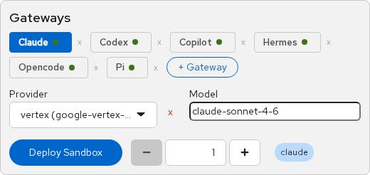
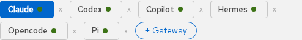
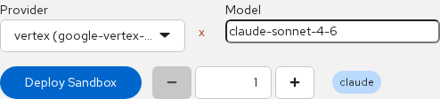

# Gateway Configuration

Topics: Per-Agent Gateways, Deploy, Delete, Inference

Each agent type (Claude, Codex, OpenCode, etc.) runs on its own gateway. A gateway is an OpenShell server that manages sandboxes, providers, and inference routing for one agent type.

---

## Why Per-Agent Gateways?

OpenShell has **one inference route per gateway**. All sandboxes on a gateway share the same provider and model via `inference.local`. This means you need a separate gateway for each agent type so they can each have their own provider configuration.

For example:
- **Claude gateway** → Vertex AI provider → `claude-sonnet-4-6`
- **Codex gateway** → OpenAI provider → `gpt-5.4`
- **OpenCode gateway** → MaaS provider → `qwen36-27b`

---

## Gateway Tabs

The gateway panel shows one tab per deployed gateway. Click a tab to switch context — the provider, model, and deploy controls all apply to the selected gateway.

Each tab shows a green dot when the gateway is running, or a spinner while it's starting up. The **x** button next to each tab deletes the gateway and all its resources.

---

## Deploying a New Gateway

Click **+ Gateway** to add a new agent type. Select from the available types:

| Agent Type | Sandbox Image | Description |
|-----------|--------------|-------------|
| Claude Code | `base` | Anthropic's coding agent |
| Codex | `base` | OpenAI's coding agent |
| OpenCode | `base` | Open-source coding agent |
| Copilot | `base` | GitHub Copilot CLI (BYOK mode) |
| Pi | `pi` | Minimal terminal coding harness |
| Hermes | custom | NousResearch Hermes agent framework |
| Ollama | `ollama` | Bundled Ollama server + Claude Code + Codex |

The gateway takes about 30 seconds to deploy. It creates a StatefulSet, Service, ConfigMap, and PVC in your namespace.

---

## Provider and Model

Once a gateway is running, configure it with a provider and model:

1. **Provider** — select an existing provider or click **+ New provider** to register one
2. **Model** — type a model ID or select from the suggestions (varies by agent type)
3. **Deploy Sandbox** — creates a sandbox running the agent with the configured inference

The model suggestions are hints. You can type any model ID your provider supports.

---

## Deleting a Gateway

Click the **x** button on a gateway tab. This removes the StatefulSet, Service, ConfigMap, certgen Job, JWT Secret, and PVC. Any sandboxes created by that gateway remain until you delete them individually.

<strong>Warning</strong>

Deleting a gateway removes its provider credentials and inference configuration. You will need to re-register providers if you redeploy the gateway.

---

## Next Steps

- [Provider Configuration](providers) — how to register providers with API credentials
- [Agent List & Sandboxes](agent-list) — deploy and manage sandboxes
- [OpenShell TUI](openshell-tui) — gateway logs and sandbox details
