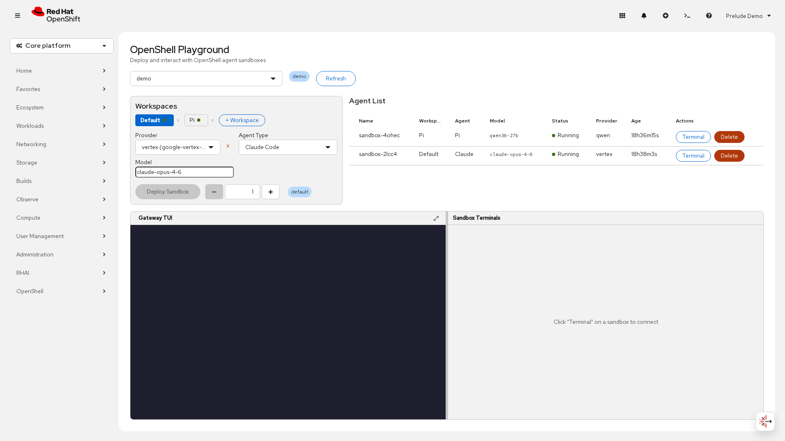
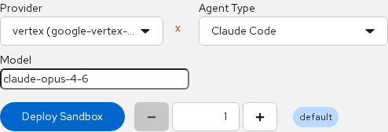
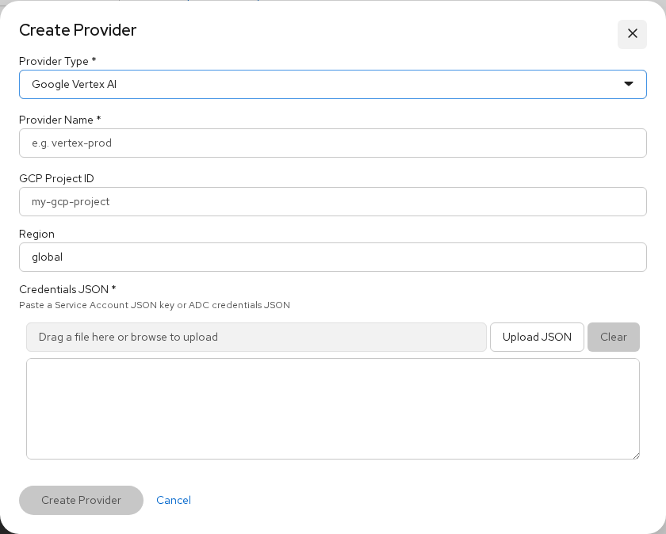

# Workspace Configuration

Topics: Workspaces, Providers, Inference, Deploy

OpenShell Playground uses a single **gateway** per namespace with multiple **workspaces**. Each workspace has its own independently configured inference route, providers, and sandboxes — so different agent types (Claude, Codex, Pi) can each have their own model and provider without needing separate gateway pods.

---

## Architecture

| Concept | Description |
|---------|-------------|
| **Gateway** | A single OpenShell gateway pod (`openshell-0`) per namespace |
| **Workspace** | An isolation boundary within the gateway — each has its own inference route and providers |
| **Default workspace** | Created automatically with the gateway; cannot be deleted |
| **Named workspace** | One per agent type (e.g. `claude`, `pi`, `codex`) |

One gateway supports N workspaces. A sandbox is always created inside a specific workspace and uses that workspace's inference route at runtime.

---

## Workspace Tabs

The **Workspaces** panel shows one tab per workspace. Click a tab to switch context — the provider, model, and deploy controls all apply to the selected workspace.

The active tab has a green dot when the gateway is running. The **x** button on a tab deletes that workspace (and its sandboxes). Deleting the `Default` workspace tears down the entire gateway.

---

## Adding a Workspace

Click **+ Workspace** to add a new workspace. Select the agent type — this both names the workspace and determines which sandbox image to use:

| Agent Type | Sandbox Image | Workspace Name |
|-----------|--------------|----------------|
| Claude Code | `base` | `claude` |
| Codex | `base` | `codex` |
| OpenCode | `base` | `opencode` |
| Copilot | `base` | `copilot` |
| Pi | `pi` | `pi` |
| Hermes | custom | `hermes` |
| Ollama | `ollama` | `ollama` |

The gateway pod is shared — only the first workspace creation deploys the pod. Subsequent workspaces are added to the same pod instantly.

---

## Provider and Model

Each workspace has its own provider and model configuration:

1. **Provider** — select an existing provider or click **+ New provider** to register one (scoped to this workspace)
2. **Agent Type** — which sandbox image to use for new sandboxes (independent of workspace name)
3. **Model** — the model to use for inference in this workspace
4. **Deploy Sandbox** — creates a sandbox in the selected workspace

<strong>Tip</strong>

Each workspace has its own provider credentials. A Claude workspace can use Vertex AI while a Codex workspace uses OpenAI — all on the same gateway pod.

---

## Provider Configuration

Providers are registered per workspace. The same provider name can exist independently in different workspaces with different credentials.

See [Provider Configuration](providers) for full details on credential types.

---

## Gateway TUI

The Gateway TUI shows the active workspace's sandboxes and network rules. Press **`w`** inside the TUI (click the terminal area first to focus it) to cycle through workspaces:

`default` → `claude` → `pi` → `all` → `default`

The `all` view shows sandboxes across every workspace.

---

## Deleting a Workspace

Click the **x** on a workspace tab. This:
- Deletes the workspace and all its sandboxes
- Keeps the gateway pod running (other workspaces are unaffected)
- If it's the last workspace, tears down the entire gateway

Deleting **Default** tears down the entire gateway (the default workspace cannot be deleted via OpenShell, so this acts as a "delete everything" action).

---

## Next Steps

- [Provider Configuration](providers) — register credentials per workspace
- [Agent List & Sandboxes](agent-list) — deploy and manage sandboxes
- [OpenShell TUI](openshell-tui) — gateway TUI and network rules
