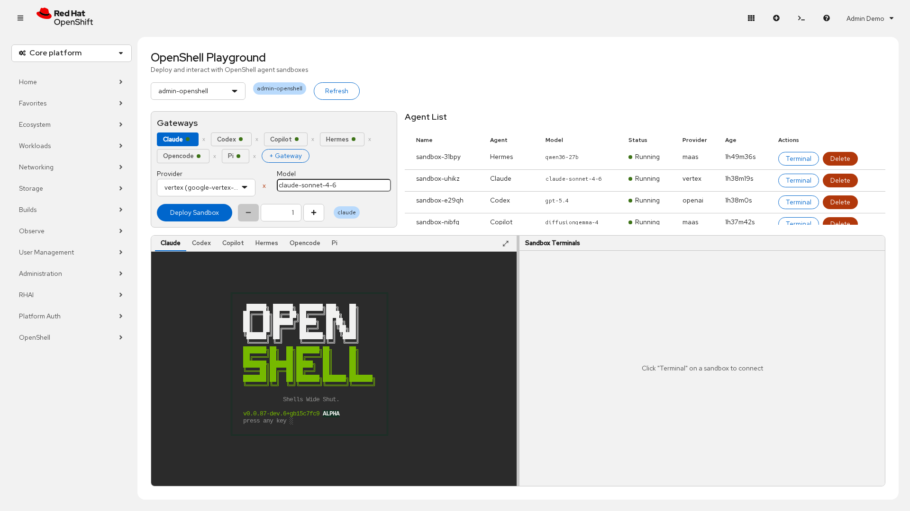

# Getting Started

Topics: Overview, Layout, First Steps

OpenShell Playground is an OpenShift Console plugin that lets you deploy AI coding agent sandboxes and interact with them through embedded terminals. It integrates with NVIDIA OpenShell's sandbox runtime to provide a web UI for managing gateways, providers, inference, and agent sessions.

---

## Page Layout

The playground is divided into four main areas:

| Area | Purpose |
|------|---------|
| **Gateways** (top-left) | Deploy and manage per-agent-type gateways, register providers, set models |
| **Agent List** (top-right) | View deployed sandboxes, open terminals, delete sandboxes |
| **OpenShell TUI** (bottom-left) | Gateway terminal showing sandbox details, logs, and network rules |
| **Sandbox Terminals** (bottom-right) | Interactive terminals connected to agent sandboxes |

The bottom panels have a draggable divider between them. Each panel also has a fullscreen button.

---

## Quick Start

1. **Select a namespace** from the dropdown at the top of the page
2. **Deploy a gateway** for your chosen agent type (Claude, Codex, OpenCode, etc.)
3. **Register a provider** (Anthropic, OpenAI, Google Vertex AI) with your API credentials
4. **Set a model** and click **Deploy Sandbox**
5. Click **Terminal** on the running sandbox to open an interactive shell
6. Run the agent command shown in the terminal prompt

---

## Next Steps

- [Gateway Configuration](gateways) — learn how gateways work and how to deploy them
- [Provider Configuration](providers) — set up API credentials for different providers
- [Agent List & Sandboxes](agent-list) — manage your deployed sandboxes
