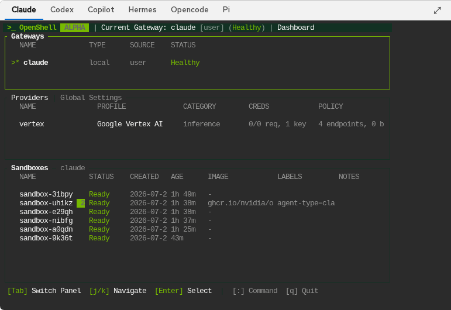
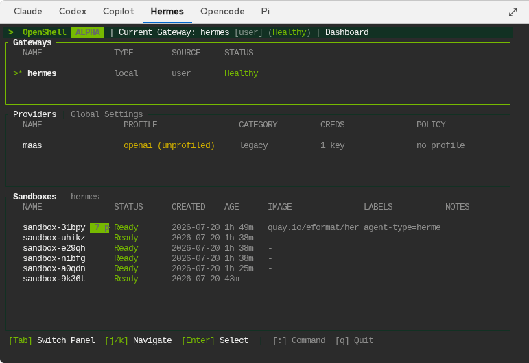

# OpenShell TUI

Topics: Gateway TUI, Logs, Network Rules, Policy

The OpenShell TUI (Terminal User Interface) is an embedded terminal running the `openshell term` command inside each gateway. It provides a real-time view of gateway health, sandbox status, logs, and network policy rules.

---

## TUI Tabs

One tab per deployed gateway. Click a tab to switch between gateway views. Each tab shows the gateway's agent type name (Claude, Codex, etc.).

The TUI connects via a ttyd sidecar running in the gateway pod. It loads in an iframe and renders the full OpenShell terminal interface.

---

## Dashboard Sections

The TUI dashboard is split into several panels:

### Gateways

Shows the gateway connection status:

| Field | Meaning |
|-------|---------|
| **Name** | Gateway name (matches the agent type) |
| **Type** | Always `local` (the CLI is running inside the gateway pod) |
| **Source** | `user` — configured by the plugin |
| **Status** | `Healthy` when the gateway gRPC endpoint is responding |

### Providers

Lists registered inference providers:

| Field | Meaning |
|-------|---------|
| **Name** | Provider name you chose when registering |
| **Profile** | Provider type (Google Vertex AI, OpenAI, etc.) |
| **Category** | `inference` — all providers serve inference |
| **Creds** | Credential status (e.g., `0/0 req, 1 key`) |
| **Policy** | OPA endpoint and binary policy counts |

### Sandboxes

Lists all sandboxes managed by this gateway:

| Field | Meaning |
|-------|---------|
| **Name** | Sandbox name |
| **Status** | `Ready` when the sandbox is running and healthy |
| **Created** | Timestamp |
| **Age** | Time since creation |
| **Image** | Container image used (may be truncated) |
| **Labels** | Agent type and model labels |

---

## Sandbox Detail View

Press **Enter** on a sandbox to open its detail view. This shows:

- **Network Rules** — OPA policy rules governing what the sandbox can access. Rules show `pending`, `review required`, or `approved` status
- **Logs** — Real-time log stream from the sandbox, including inference requests, OPA policy decisions, and network activity

### Network Rules

Each sandbox starts with a set of network rules generated by OPA. Rules can be:

| Status | Meaning |
|--------|---------|
| `pending` | Rule proposed, awaiting review |
| `review required` | Needs manual approval via `[a] Approve` or `[x] Reject` |
| `approved` | Rule is active |

Use the keyboard shortcuts shown at the bottom of the TUI to navigate and manage rules.

---

## TUI Keyboard Shortcuts

| Key | Action |
|-----|--------|
| `j/k` | Navigate up/down |
| `Enter` | Select / open detail |
| `Tab` | Switch panel |
| `p` | Policy view |
| `l` | Logs view |
| `a` | Approve rule |
| `A` | Approve all rules |
| `x` | Reject rule |
| `Esc` | Back |
| `q` | Quit |

---

## Fullscreen

Click the **fullscreen** button (top-right of the TUI panel) to expand the TUI to fill the browser viewport. Press **Esc** to exit fullscreen.

---

## Next Steps

- [Agent Terminals](terminals) — connect to sandboxes and run agents
- [Agent List & Sandboxes](agent-list) — deploy and manage sandboxes
