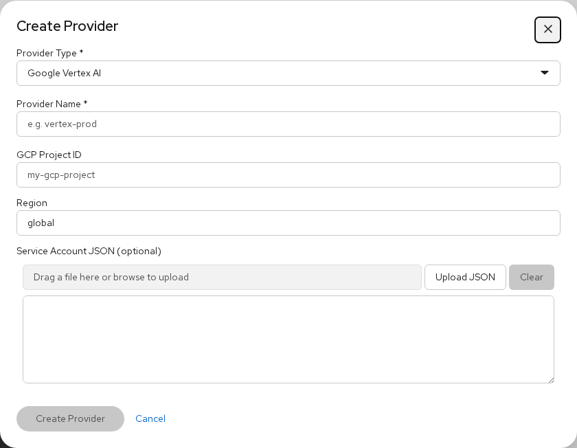

# Provider Configuration

Topics: Provider Types, Credentials, Per-Gateway

Providers supply the AI models that agents use through `inference.local`. Each gateway has its own provider configuration. Credentials are stored inside the gateway pod and never leave it.

---

## Registering a Provider

Select **+ New provider** from the Provider dropdown on any gateway tab to open the credentials modal:

---

## Provider Types

| Type | Required Fields | Notes |
|------|----------------|-------|
| **Google Vertex AI** | GCP Project ID, Region, Service Account JSON | For Claude models via Vertex. Upload your GCP service account key JSON |
| **Anthropic** | API Key | Direct Anthropic API access |
| **OpenAI / OpenAI-Compatible** | API Key, Base URL (optional) | Works with OpenAI, vLLM, MaaS, or any OpenAI-compatible endpoint |

### Google Vertex AI

Use this for Claude models through Google Cloud. You need:
- A GCP project with the Vertex AI API enabled
- A service account with `aiplatform.endpoints.predict` permission
- The service account key JSON file

The gateway uses the JSON to mint OAuth tokens internally. The credentials never reach the sandbox.

### Anthropic

Direct API key from [console.anthropic.com](https://console.anthropic.com). Set the model to a Claude model ID like `claude-sonnet-4-6`.

### OpenAI / OpenAI-Compatible

Works with:
- **OpenAI** — use your OpenAI API key, model like `gpt-5.4`
- **vLLM / MaaS** — set the base URL to your endpoint, API key can be `unused`, model like `qwen36-27b`
- **Any OpenAI-compatible server** — custom base URL + API key

---

## Provider Per Gateway

Providers are registered on a specific gateway. If you have separate Claude and Codex gateways, each needs its own provider:

- Switch to the **Claude** gateway tab → register a Vertex AI provider
- Switch to the **Codex** gateway tab → register an OpenAI provider

The provider dropdown only shows providers registered on the currently selected gateway.

---

## Deleting a Provider

Click the **x** button next to the provider dropdown to delete the selected provider from the gateway.

<strong>Tip</strong>

You can register multiple providers on the same gateway and switch between them. Only one can be active for inference at a time.

---

## How Inference Routing Works

When you deploy a sandbox with a provider and model:

1. The gateway sets its inference route: `provider → model`
2. Inside the sandbox, `inference.local` resolves to the gateway
3. The agent (Claude Code, Codex, etc.) sends API requests to `inference.local`
4. The gateway proxies the request to the configured provider with the correct credentials

This means agent sandboxes never see API keys — they just talk to `inference.local`.

---

## Next Steps

- [Gateway Configuration](gateways) — deploy and manage gateways
- [Agent List & Sandboxes](agent-list) — deploy sandboxes with your configured provider
