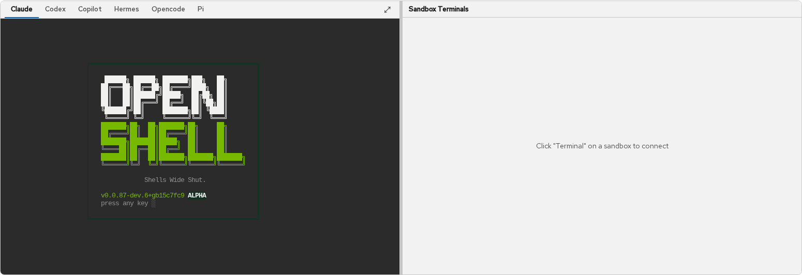

# Agent Terminals

<span class="badge">Topics: Terminal Setup, Agents, Fullscreen, Supported Agents</span>

When you click **Terminal** on a sandbox in the Agent List, a terminal tab opens in the Sandbox Terminals panel. The terminal connects to the sandbox container via a Kubernetes exec WebSocket and auto-configures the environment for the agent type.



---

## How It Works

When a terminal connects:

1. The WebSocket opens an exec session to the sandbox pod
2. The terminal enters the sandbox's network namespace via `nsenter`
3. A shell rcfile configures environment variables for TLS, proxy, and inference
4. Agent-specific setup runs (config files, model discovery)
5. You see a prompt with instructions for running the agent

---

## Per-Agent Configuration

Each agent type gets tailored terminal setup:

### Claude Code

```
Claude Code ready. Run: claude --bare
```

Environment variables set: `ANTHROPIC_BASE_URL`, `ANTHROPIC_API_KEY`, `SSL_CERT_FILE`, `CLAUDE_CODE_DISABLE_EXPERIMENTAL_BETAS`.

### Codex

```
Codex ready. Run: codex --full-auto
```

Auto-generates `/sandbox/.codex/config.toml` with a custom `openshell` provider pointing to `inference.local`. WebSocket transport is disabled (uses SSE instead) to avoid OPA policy conflicts.

### OpenCode

```
OpenCode ready. Run: opencode (new) or opencode -c (resume)
```

Auto-discovers models from `inference.local/v1/models` and generates `/sandbox/opencode.json` with an `openai-compatible` provider configuration. Includes a corrupt-database auto-recovery check.

### Copilot

```
Copilot ready. Run: copilot
```

Sets `COPILOT_PROVIDER_BASE_URL=https://inference.local/v1` and auto-detects the model. Uses BYOK mode — no GitHub login required.

### Pi

```
Pi ready. Run: pi
```

Auto-generates `~/.pi/agent/models.json` with models discovered from the gateway. Select the model inside Pi with `/model`.

### Hermes

```
Hermes Agent ready. Run: hermes chat
```

Pre-creates all required Hermes directories and fixes filesystem permissions.

### Ollama

```
Ollama sandbox ready. Run: ollama
```

Configures all bundled agents (Claude Code, Codex, OpenCode) to use `inference.local`. The Ollama server auto-starts with the sandbox for local model serving.

---

## Environment Variables

All agent terminals share these base environment variables:

| Variable | Value | Purpose |
|----------|-------|---------|
| `HTTPS_PROXY` | `http://10.200.0.1:3128` | Route traffic through OpenShell supervisor proxy |
| `SSL_CERT_FILE` | `/etc/openshell-tls/ca-bundle.pem` | Trust the gateway's self-signed TLS CA |
| `NODE_EXTRA_CA_CERTS` | `/etc/openshell-tls/openshell-ca.pem` | Node.js TLS trust |
| `CODEX_CA_CERTIFICATE` | `/etc/openshell-tls/ca-bundle.pem` | Codex (Rust) TLS trust |
| `ANTHROPIC_BASE_URL` | `https://inference.local` | Route Claude API calls through gateway |
| `OPENAI_BASE_URL` | `https://inference.local/v1` | Route OpenAI API calls through gateway |
| `OPENAI_API_KEY` | `unused` | Required by SDKs but not used (gateway handles auth) |

---

## Fullscreen

Click the fullscreen button in the Sandbox Terminals header to expand the terminal to fill the browser viewport. Press **Esc** to exit.

---

## Terminal Lifecycle

When you close a terminal tab, the exec session ends and child processes (including running agents) are terminated. The `set +m` shell option and `trap 'kill 0' EXIT` ensure clean process cleanup.

If you reopen a terminal to the same sandbox, the environment is reconfigured from scratch. Agent session data persists on the sandbox's workspace PVC:
- **OpenCode**: sessions in `/sandbox/.local/share/opencode/`
- **Claude Code**: sessions in `/sandbox/.claude/`
- **Hermes**: sessions in `/sandbox/.hermes/sessions/`

<div class="alert alert-info">
<strong>Tip</strong>
<p>Use <code>opencode -c</code> or <code>hermes chat</code> to resume a previous agent session after reconnecting.</p>
</div>

---

## Supported Agents Summary

| Agent | Command | Provider | Sandbox Image |
|-------|---------|----------|--------------|
| Claude Code | `claude --bare` | Anthropic, Vertex AI | `base` |
| Codex | `codex --full-auto` | OpenAI, OpenAI-compatible | `base` |
| OpenCode | `opencode` | Any (via opencode.json) | `base` |
| Copilot | `copilot` | Any (BYOK) | `base` |
| Pi | `pi` | Any (via models.json) | `pi` |
| Hermes | `hermes chat` | OpenAI-compatible | custom |
| Ollama | `ollama` | Local + inference.local | `ollama` |

---

## Next Steps

- [Getting Started](getting-started) — overview and quick start
- [OpenShell TUI](openshell-tui) — gateway logs and sandbox network rules
